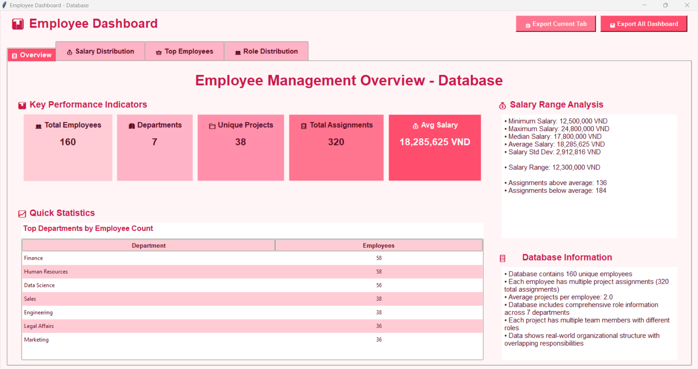
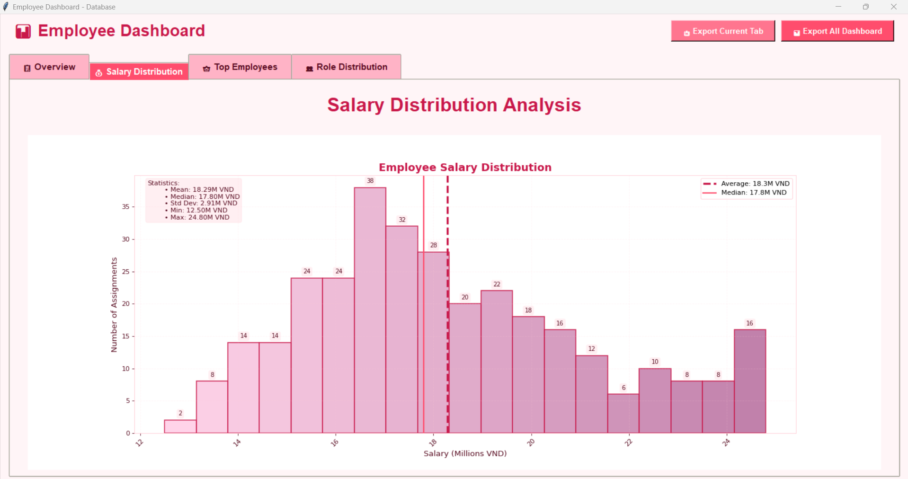
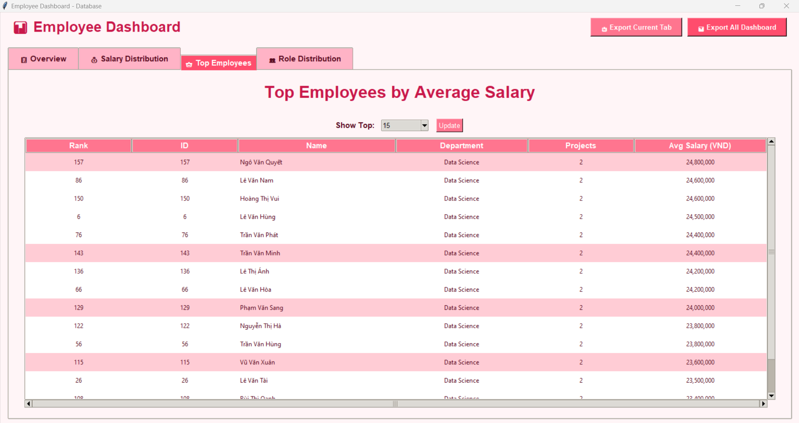
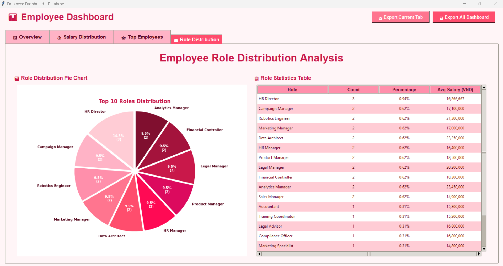
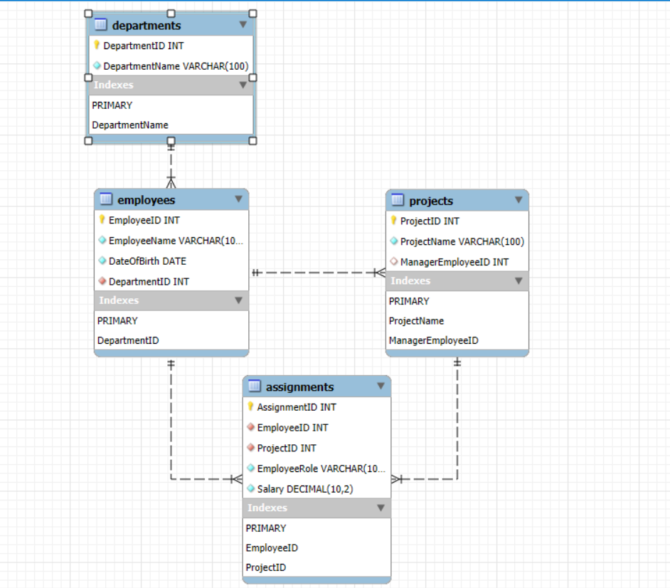

markdown
#  Employee Information Manager v1.0.0


##  Table of Contents
- [Project Overview](#project-overview)
- [Features](#features)
- [Tech Stack](#tech-stack)
- [Installation & Setup](#installation--setup)
- [Running in VS Code](#running-in-vs-code)
- [Database Schema](#database-schema)
- [Project Structure](#project-structure)
- [Usage Guide](#usage-guide)
- [Team & Contributions](#team--contributions)
- [Documentation](#documentation)

##  Project Overview

**Employee Information Manager** is a comprehensive database application developed as part of the **Introduction to Databases** course at **National Economics University**. The project addresses real-world HR data management problems by transforming unnormalized employee data into a robust **3NF database schema** with an intuitive **Python GUI application**.

###  **Learning Objectives Demonstrated**
- ✅ **Data Modeling**: Normalized UNF table to 1NF → 2NF → 3NF
- ✅ **Database Implementation**: MySQL schema with PK/FK constraints
- ✅ **Application Development**: Python GUI with CRUD operations
- ✅ **Collaboration**: GitHub workflow with issues/PRs
- ✅ **Communication**: LaTeX report, presentation slides, demo video

###  **Project Requirements Met**
- **3NF Normalized Schema** with proper PK/FK relationships
- **Python GUI Application** with Tkinter interface
- **Four Required Queries** with CSV export functionality
- **Interactive Dashboard** with visualizations
- **Comprehensive Documentation** including LaTeX report

##  Features

###  **Core CRUD Operations**
- **Employees**: Create, Read, Update, Delete employee records
- **Departments**: Manage organizational departments
- **Projects**: Track projects and assign managers
- **Assignments**: Link employees to projects with roles and salaries

###  **Analytical Queries**
1. **INNER JOIN**: Employee roles and salaries per project
2. **LEFT JOIN**: All employees including those without projects
3. **Multi-table JOIN**: Employee-Project-Role-Salary-Manager relationships
4. **Above Global Average**: Employees with above-average salaries

###  **Dashboard & Visualizations**
- **KPI Metrics**: Total employees, departments, projects, assignments
- **Salary Analysis**: Average salary, distribution histogram
- **Top Performers**: Top-N employees by average salary
- **Role Distribution**: Pie chart of organizational roles

###  **Search & Filter System**
- Global search by employee name
- Filter by department, project, role, salary range, manager
- Real-time results updating

###  **Data Validation**
- Required field validation
- Date format validation
- Salary range validation (≥ 0)
- Unique constraint enforcement

##  Tech Stack

### **Backend**
- **Python 3.8+**: Core application logic
- **MySQL 8.0+**: Relational database
- **mysql-connector-python**: Database connectivity

### **GUI Framework**
- **Tkinter**: Desktop GUI application
- **ttkthemes**: Enhanced UI styling
- **Matplotlib**: Data visualization

### **Development Tools**
- **VS Code**: Primary IDE
- **Git & GitHub**: Version control
- **MySQL Workbench**: Database management
- **LaTeX**: Report generation

##  Installation & Setup

### **Prerequisites**
- Python 
- MySQL Server 8.0 
- VS Code with Python extension
- Git

### **Step 1: Clone Repository**
```
bash
git clone https://github.com/your-team/employee-info-manager.git
cd employee-info-manager
code .  # Opens VS Code
```
### **Step 2: Set Up Virtual Environment**
In VS Code terminal:
```
bash
# Create virtual environment
python -m venv venv

# Activate (Windows)
venv\Scripts\activate

# Activate (macOS/Linux)
source venv/bin/activate
```
### **Step 3: Install Dependencies**
```
bash
pip install -r requirements.txt
```
### **Step 4: Configure MySQL Database**
Open MySQL Workbench or VS Code MySQL extension
1. Open MySQL Workbench or the VS Code MySQL extension.  
2. Copy the content of both files: `schema.sql` and `seed.sql`.  
3. Run the `schema.sql` file first to create the tables.  
4. Then run the `seed.sql` file to insert sample data.
### **Step 5: Configure Environment Variables**
Create .env file in root directory:
```
env
DB_HOST=localhost
DB_PORT=3306
DB_USER=root
DB_PASSWORD=your_password
DB_NAME=employee_information_manager
DEBUG=True
```
### **Step 6: Initialize Database**
In VS Code terminal:
```
bash
# Import schema
mysql -u root -p employee_manager < database/schema.sql

# Load sample data
mysql -u root -p employee_manager < database/seed.sql
```
### ⚠️ Important Note Before Running

Before running the program, you need to update the file path for `database.csv` in the `load_data` function:
```python
def load_data(self):
    """Load and preprocess data from database.csv"""
    try:
        # Load the database.csv file
        self.data = pd.read_csv('C:\\Users\\Laptop\\...\\database.csv')
        print(f"Successfully loaded database.csv")
        print(f"Total records: {len(self.data)}")
```
How to update the path:
1. Locate the database.csv file in your project.
2. Right-click the file → select Copy path.
3. Paste the copied path into the code above, replacing 'C:\\\Users\\\YourPath\\\database.csv'.
4. Important: In Python, file paths must use double backslashes \\\ (e.g., C:\\\Users\\\Laptop\\\Documents\\\...).

## Running in VS Code
- VS Code Launch Configuration
Create .vscode/launch.json:
```
json
{
    // Use IntelliSense to learn about possible attributes.
    // Hover to view descriptions of existing attributes.
    // For more information, visit: https://go.microsoft.com/fwlink/?linkid=830387
    "version": "0.2.0",
    "configurations": [

        {
            "name": "Run employee-info-manager",
            "type": "debugpy",
            "request": "launch",
            "program": "${file}",
            "console": "integratedTerminal"
        }
    ]
}
```
## Running the Application
- Open src/main.py in VS Code
- Press F5 or click Run → Start Debugging
- Or run in terminal:
```
bash
python src/main.py
```
## VS Code Extensions Recommended
- Python: Microsoft Python extension
- MySQL: MySQL management tools
- GitLens: Git integration
- LaTeX Workshop: For report editing

##  Database Schema
### Normalization Process
- UNF → 1NF: Made values atomic, one project-role-salary per row
- 1NF → 2NF: Removed partial dependencies
- 2NF → 3NF: Eliminated transitive dependencies

### Final 3NF Tables
```
sql
-- Departments
CREATE TABLE Departments (
    DepartmentID INT PRIMARY KEY AUTO_INCREMENT,
    DepartmentName VARCHAR(100) UNIQUE NOT NULL
);

-- Employees
CREATE TABLE Employees (
    EmployeeID INT PRIMARY KEY AUTO_INCREMENT,
    Name VARCHAR(100) NOT NULL,
    DateOfBirth DATE NOT NULL,
    DepartmentID INT,
    FOREIGN KEY (DepartmentID) REFERENCES Departments(DepartmentID)
);

-- Projects
CREATE TABLE Projects (
    ProjectID INT PRIMARY KEY AUTO_INCREMENT,
    ProjectName VARCHAR(100) UNIQUE NOT NULL,
    ManagerEmployeeID INT,
    FOREIGN KEY (ManagerEmployeeID) REFERENCES Employees(EmployeeID)
);

-- Assignments
CREATE TABLE Assignments (
    AssignmentID INT PRIMARY KEY AUTO_INCREMENT,
    EmployeeID INT NOT NULL,
    ProjectID INT NOT NULL,
    Role VARCHAR(50) NOT NULL,
    Salary DECIMAL(10,2) CHECK (Salary >= 0),
    FOREIGN KEY (EmployeeID) REFERENCES Employees(EmployeeID),
    FOREIGN KEY (ProjectID) REFERENCES Projects(ProjectID),
    UNIQUE (EmployeeID, ProjectID)
);
```
### Sample Data Statistics
- 160 Employees
- 7 Departments
- 38 Projects
- 320 Assignments
- 18+ Distinct Roles

##  Project Structure

```
text
employee-info-manager/
├── .vscode/               
│   ├── launch.json
│   └── settings.json
├── app/
│   ├── db/           
│   │   ├── connection.py
│   │   ├── schema.sql
│   │   └── seed.sql              
│   ├── services/          
│   │   ├── crud_employees_service.py
│   │   ├── crud_departments_service.py
│   │   ├── crud_projects_service.py
│   │   └── crud_assignments_service.py
│   │   └── dashboard.py
│   │   └── database.csv
│   │   └── queries.py
│   │   └── search_filter.py
│   ├── ui/
│   │   ├── login_window.py                
│   │   ├── main_window.py
│   │   ├── employees_ui.py
│   │   ├── departments_ui.py
│   │   ├── projects_ui.py
│   │   ├── assignments_ui.py
│   │   ├── queries_inner.py
│   │   └── search_and_filter.py
│   │   └── export.py
├── documentary/                    
│   ├── report.pdf/            
│   ├── slides.pdf/           
├── screenshot
│   ├── db1.png
│   ├── db2.png
│   ├── db3.png
│   ├── db4.png
│   ├── erd.png
├── utils
│   ├── create_user.py
├── tests/
│   ├── __init__.py
│   ├── test_db.py
│   ├── test_services.py          
├── .env.example
├── .gitignore
├── requirements.txt        
├── README.md               # This file
└── .gitattributes          
```
##  Usage Guide

### Starting the Application
- Ensure MySQL is running
- Activate virtual environment
- Run python src/main.py
- Or use VS Code debugger (F5)

### Main Features

1. Dashboard

- View organizational KPIs
  
- Analyze salary distribution
  
- Identify top performers
  
- Monitor role distribution
  

2. CRUD Operations

- Employees: Add/edit/delete employee records
- Departments: Manage organizational units
- Projects: Create and assign projects
- Assignments: Link employees to projects

3. Analytical Queries

- Run four required queries
- Sort and filter results
- Export to CSV format

4. Search & Filter

- Search by employee name
- Filter by multiple criteria
- Real-time results

##  Team & Contributions
### Team members
1. Tran Phuong Oanh (11247338)

- Database normalization (UNF → 3NF)
- MySQL schema design
- Sample data generation
- ERD creation
- Dashboard visualizations
- Documentation and README
  
2. Bui Phuong Thao (11247353)

- Tkinter GUI design
- CRUD forms implementation
- Search and filter system
- UI/UX testing
- Responsive design
- Error handling
  
3. Nguyen Ha Vy (11247374)

- Database connection layer
- Business logic services
- Input validation
- Error handling
- Documentation and README
- Responsive design
  
### GitHub Collaboration

- Project Board: Kanban-style task management
- Issues & PRs: Systematic workflow
- Version Control: Regular commits with meaningful messages

##  Documentation

1. Project Deliverables: 

- 📄 LaTeX Report
- 🎓 Presentation Slides
- 🎥 Demo Video
- 📊 ER Diagram: 


2. Academic Requirements Met

- ✅ 3NF normalization explained
- ✅ PK/FK relationships justified
- ✅ Functional dependencies analyzed
- ✅ Sample data meets requirements
- ✅ All queries implemented
- ✅ Dashboard with visualizations

##  Testing & Validation

1. Testing Strategy

- Unit Testing: Individual components
- Integration Testing: Database-GUI connectivity
- User Acceptance Testing: Real-world scenarios
- Edge Case Testing: Boundary conditions

2. Validation Rules

- Required Fields: Cannot be empty
- Date Validation: Proper date format
- Salary Validation: Numeric, ≥ 0
- Unique Constraints: Prevent duplicates
- FK Integrity: Maintain relationships

##  Limitations & Future Work
1. Current Limitations

- No authentication system
- Desktop-only application
- Basic error handling
- Limited concurrent users

2. Future Enhancements

- Role-based access control
- Web application version
- Advanced analytics
- Mobile compatibility
- API integration

## Acknowledgements

- Dr. Hung Tran: Course instructor and project advisor
- National Economics University: Academic institution
- Open Source Community: Tools and libraries used

## 🔗 Quick Links

- 📂 GitHub Repository: [GitHub Repository](https://github.com/Buithaoaineu/Group_number_3)
- 🎥 Demo Video: [YouTube Demo](https://youtu.be/MmStJCzWH4w?si=LT9qPqY3Dzx7Qs9x)
- 📄 Full Report: [Download PDF Report](employee_info_manager/documentary/report.pdf) 
- 🎓 Presentation Slides: [Download PDF Slides](employee_info_manager/documentary/slides.pdf)
- 🐛 Issue Tracker: GitHub Issues

## Contact & Support

- 📧 Contact: oanhtran020906@gmail.com
- 🏫 Institution: National Economics University
- 🎓 Course: Introduction to Databases
- 👨‍🏫 Instructor: Dr. Hung Tran
- 📅 Submission Date: December 2025

# Built with ❤️ for the Introduction to Database course.

